# Employee Management API

A backend REST API built using **FastAPI, Python, MySQL, and SQLAlchemy** to manage employee records.

The project demonstrates CRUD operations, request validation, database integration, search and filtering, pagination, error handling, and Swagger API documentation.

---

# Features

* Employee CRUD operations
* MySQL database integration
* SQLAlchemy ORM
* Pydantic request and response validation
* Email validation
* Search employees by name
* Filter employees by department
* Filter employees by work mode
* Pagination using `limit` and `offset`
* Total employee count
* Error handling with appropriate HTTP status codes
* Automatic API documentation using Swagger UI
* Environment variable configuration using `.env`

---

# Technologies Used

* **Python**
* **FastAPI**
* **Pydantic**
* **SQLAlchemy**
* **MySQL**
* **PyMySQL**
* **Uvicorn**
* **python-dotenv**
* **email-validator**
* **Swagger UI**

---

# Project Structure

```text
FRAMEWORK/
│
├── main.py
├── database.py
├── models.py
├── schemas.py
├── crud.py
├── requirements.txt
├── .env
├── .env.example
├── .gitignore
├── README.md
│
└── screenshots/

```

---

#  Setup Instructions

# 1. Clone the Repository

Clone the project repository:

```bash
git clone <YOUR_GITHUB_REPOSITORY_URL>
```

Move into the project directory:

```bash
cd FRAMEWORK
```

---

# 2. Create a Virtual Environment

Create a Python virtual environment:

```bash
python -m venv venv
```

Activate the virtual environment on Windows:

```bash
venv\Scripts\activate
```

After activation, the terminal should show:

```text
(venv)
```

---

# 3. Install Dependencies

Install all required packages:

```bash
pip install -r requirements.txt
```

---

# Database Configuration

This project uses **MySQL** as the database.

Make sure MySQL Server is installed and running on your system.

Create the database:

```sql
CREATE DATABASE employee_db;
```

---

# Environment Variables

Create a `.env` file in the project root directory.

Example:

```env
DB_USER=root
DB_PASSWORD=your_mysql_password
DB_HOST=localhost
DB_PORT=3306
DB_NAME=employee_db
```

# `.env.example`

The repository also contains a `.env.example` file with dummy values:

```env
DB_USER=root
DB_PASSWORD=your_password
DB_HOST=localhost
DB_PORT=3306
DB_NAME=employee_db
```

---

#  Running the Application

Start the FastAPI application using Uvicorn:

```bash
python -m uvicorn main:app --reload
```

The application will start at:

```text
http://127.0.0.1:8000
```

---

# API Documentation

FastAPI automatically provides interactive API documentation.

# Swagger UI

Open:

```text
http://127.0.0.1:8000/docs
```

Swagger UI allows you to:

* View available endpoints
* Check request and response schemas
* Enter request data
* Execute API requests
* View HTTP status codes
* Test validation and error responses

# ReDoc

Alternative API documentation is available at:

```text
http://127.0.0.1:8000/redoc
```

---

# Employee API

The Employee API provides operations for creating, viewing, updating, deleting, searching, and filtering employee records.

# Employee Fields

The employee records contain fields such as:

| Field           | Description                |
| --------------- | -------------------------- |
| `id`            | Auto-generated employee ID |
| `name`          | Employee name              |
| `email`         | Employee email address     |
| `department`    | Employee department        |
| `primary_skill` | Primary technical skill    |
| `location`      | Employee location          |
| `work_mode`     | Work mode                  |
| `is_active`     | Employee active status     |
| `created_at`    | Record creation date       |

---

# 🔹 Employee Endpoints

# Create Employee

```http
POST /employees
```

Example request:

```json
{
    "name": "Stephen",
    "email": "stephen@example.com",
    "department": "Testing",
    "primary_skill": "Python",
    "location": "Chennai",
    "work_mode": "WFH",
    "is_active": true
}
```

---

# Get All Employees

```http
GET /employees
```

Returns a list of employee records.

---

# Get Employee by ID

```http
GET /employees/{employee_id}
```

Example:

```text
GET /employees/1
```

---

# Update Employee

```http
PUT /employees/{employee_id}
```

Example:

```text
PUT /employees/1
```

---

# Delete Employee

```http
DELETE /employees/{employee_id}
```

Example:

```text
DELETE /employees/1
```

---

#  Employee Search and Filtering

The API supports searching and filtering using query parameters.

```http
GET /employees/search
```

# Search by Name

```text
/employees/search?name=Stephen
```

# Filter by Department

```text
/employees/search?department=Testing
```

# Filter by Work Mode

```text
/employees/search?work_mode=WFH
```

# Combine Filters

```text
/employees/search?name=Stephen&department=Testing&work_mode=WFH
```

---

#  Work Mode Validation

The `work_mode` field accepts only the following values:

```text
WFH
WFO
```

# Valid Example

```json
{
    "work_mode": "WFH"
}
```

or:

```json
{
    "work_mode": "WFO"
}
```

# Invalid Example

```json
{
    "work_mode": "HYBRID"
}
```

The API returns:

```http
422 Unprocessable Content
```

when an unsupported work mode is provided.

---

#  Pagination

The employee search endpoint supports pagination using:

* `limit`
* `offset`

### Example

```text
/employees/search?limit=5&offset=0
```

This returns the first 5 records.

To retrieve the next set of records:

```text
/employees/search?limit=5&offset=5
```

### Pagination Parameters

| Parameter | Description                        |
| --------- | ---------------------------------- |
| `limit`   | Maximum number of records returned |
| `offset`  | Number of records skipped          |

Example:

```text
limit=5
offset=10
```

This means:

> Skip the first 10 records and return the next 5 records.

---

#  Database

The application uses:

```text
MySQL
```

with:

```text
Database Name: employee_db
```

SQLAlchemy is used as the ORM layer.

The database connection is configured using environment variables.

---

#  SQLAlchemy

SQLAlchemy is used to:

* Define database models
* Create database queries
* Insert records
* Update records
* Delete records
* Retrieve records
* Manage database sessions

---

#  Validation

The API uses Pydantic for request validation.

Examples of validation include:

* Required fields
* Email format
* String validation
* Numeric validation
* Work mode validation
* Request body validation

Invalid requests return appropriate FastAPI validation errors.

Example:

```http
422 Unprocessable Content
```

---

#  Error Handling

The API handles common errors such as:

* Employee not found
* Invalid employee ID
* Duplicate email
* Invalid request body
* Invalid work mode
* Database-related errors

Example:

```json
{
    "detail": "Employee not found"
}
```

---

#Swagger Screenshots

### Health of API

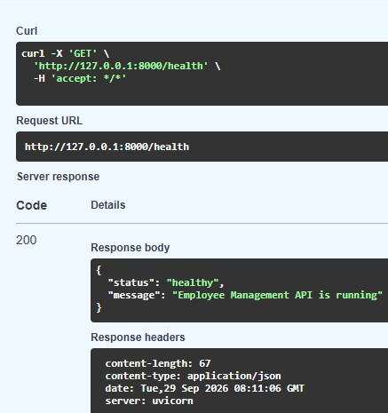

### View Employee

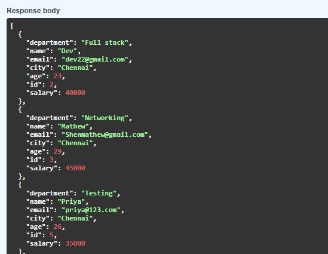

### Update 

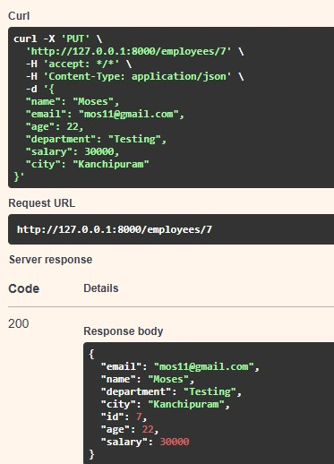

### Delete

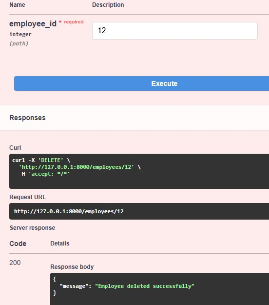

### Search and Filtering

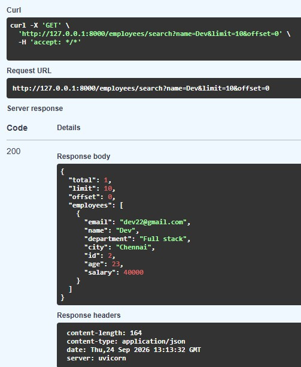

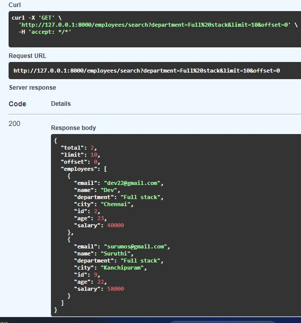

### Work Mode Validation

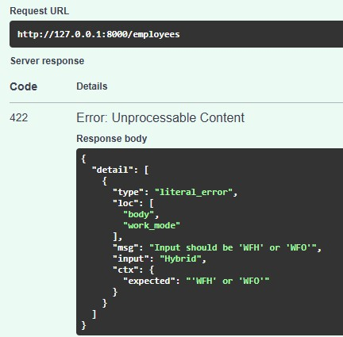

### View Work Items

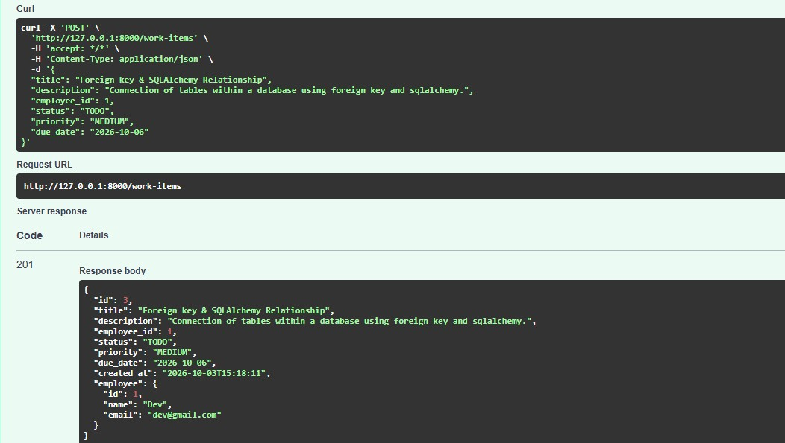

### Retreive work item by id 

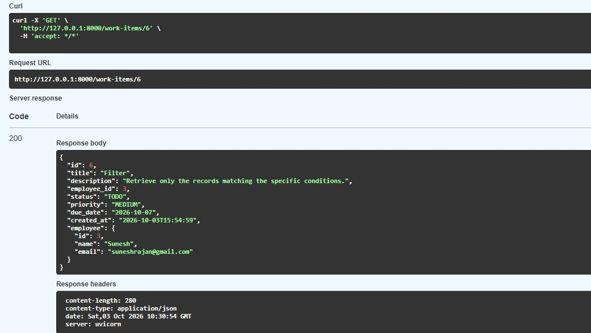

### Search using work item title

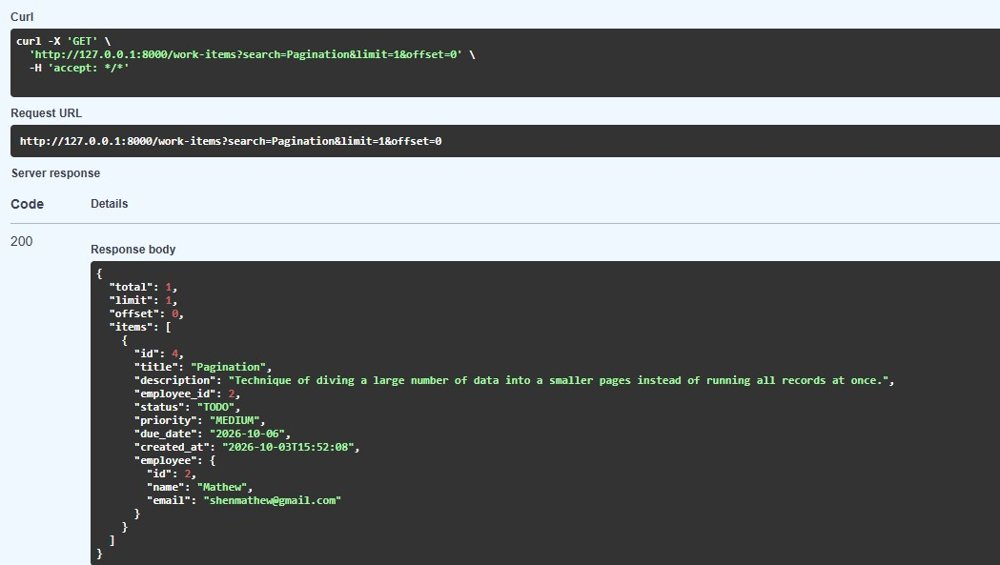

### Invalid status and Priority Values 

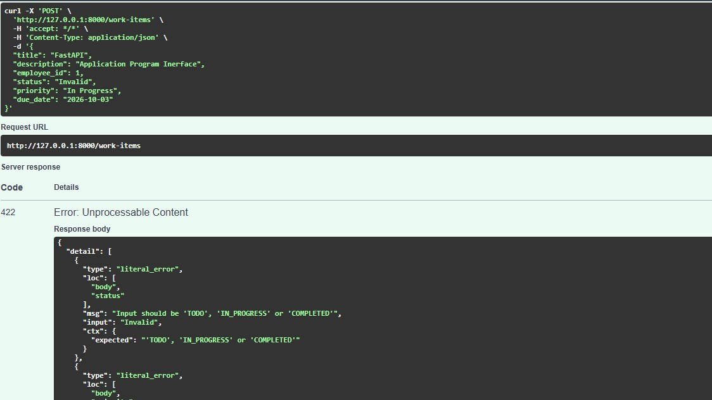

### Work Item to non existing employee

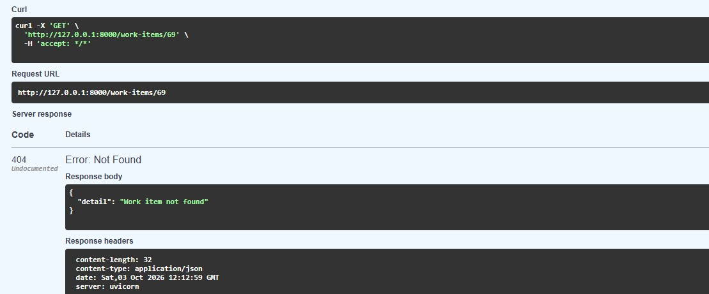

### Pagination - work item 

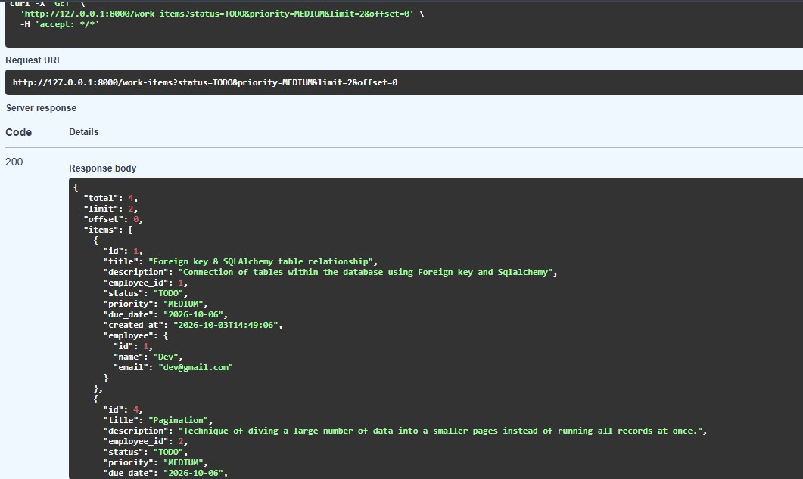

### Test combined filters

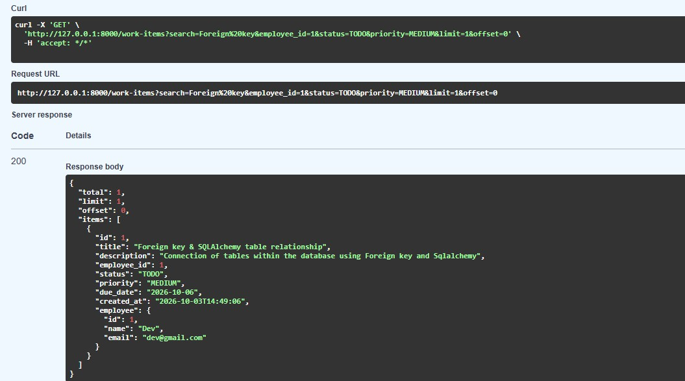

### Delete

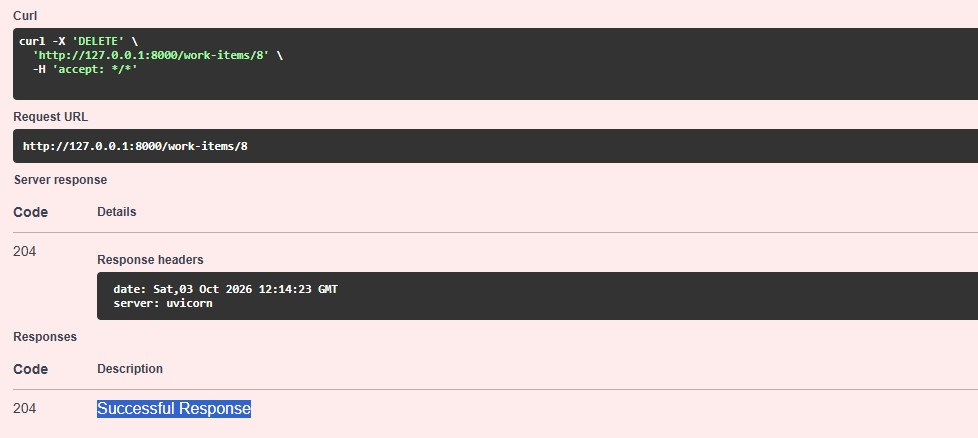

### Blank Title

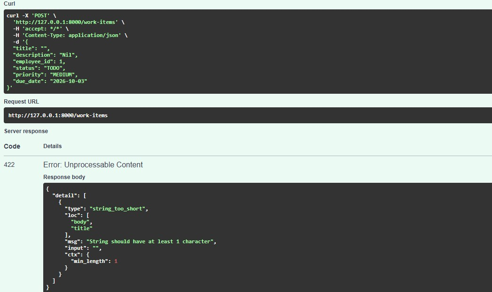

### Assign to Another Employee

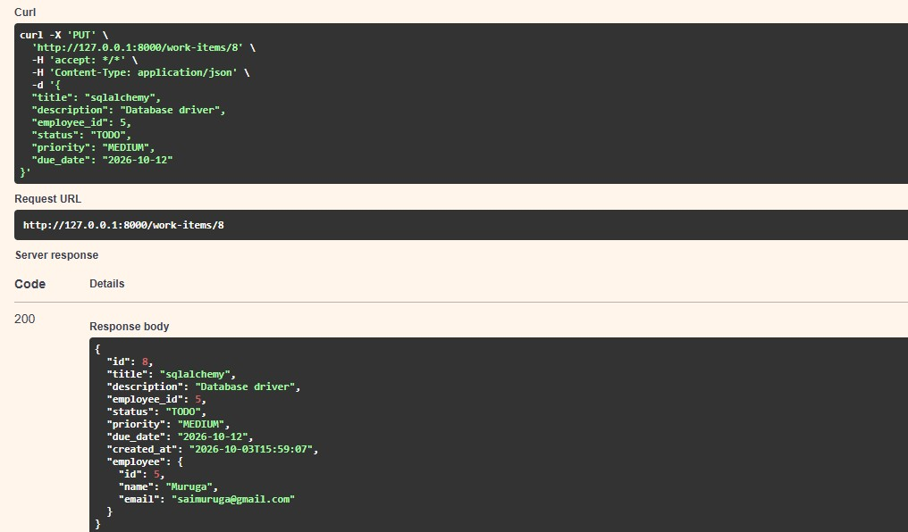

---

#  Testing

The API can be tested using:

* Swagger UI
* Postman
* Browser for GET requests

Swagger UI is available at:

```text
http://127.0.0.1:8000/docs
```

---

#  Requirements

The project dependencies are listed in:

```text
requirements.txt
```

Install them using:

```bash
pip install -r requirements.txt
```

Important packages include:

```text
fastapi
uvicorn
sqlalchemy
pymysql
python-dotenv
pydantic
email-validator
```

---

#  Security

Sensitive configuration values such as database passwords should be stored in `.env`.

The `.env` file should not be committed to the repository.

Example `.gitignore`:

```gitignore
.env
venv/
__pycache__/
*.pyc
```

---

#  Future Improvements

Possible future enhancements include:

* Employee and work item management
* JWT authentication
* Role-based access control
* Advanced employee filtering
* Sorting support
* Automated testing with Pytest
* Docker support
* Production deployment
* API logging
* Database migrations using Alembic

---

#  Author

**Devanand**

Employee Management API developed as part of backend development training using FastAPI, Python, MySQL, and SQLAlchemy.

---

#  License

This project is created for learning and development purposes.
